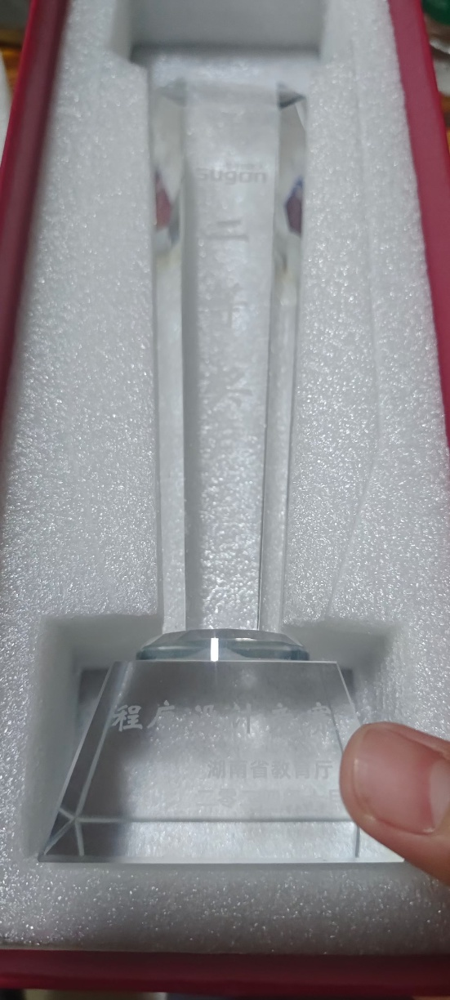

##### 🛡️ **2023.7** - 初次接触
我从高中开始就很喜欢网络安全的东西，当时最热门的我还记得就是俄罗斯黑客攻击欧洲十国的事情。也就是那会下定了我要学习网络安全的决心。

##### 🏆 2024.10 - 第一个奖项

在2024年10月，我跟着学校参加了第20届大学生程序设计竞赛网络攻防赛道，当时其实才学习了一年，十分懵懂无知，对技术方面可以说是是一窍不通（当然也不排除我大一一整年都在无所事事哈哈哈😂），但是当时赛制有一个叫做溯源的分析题，我还正好有一个文档模板，不知道是不是因为这个狗运获得了二等奖（雾），但也是自己的第一个奖项，值得开心

后面的话还拿了第二十一届的第二名（25年），也就是一等奖，2025iscc的二等奖，还有金砖国家什么的一个比赛的二等奖，那都是后话了，当然和正在看这篇文章的你来说，可能这些奖也一文不值，因为我相信屏幕前的你一定会成为你所在行业的业界大佬~⭐😉

##### 💻 **2025.3** - Pwn 探索  

2025年3月，一次操作系统课上让我深深的喜欢上了底层的东西。也算是我对底层探索的开始，后面慢慢接触到了Pwn（二进制漏洞利用），我相信总会有一天我可以攀登上二进制安全的顶层的！💪💪💪

 2025.10.22注：后面我会把一些基础知识以及我的刷题题解（对我那时的阶段而言比较有意思的）都会丢上来供各位业内大佬审阅，请轻喷🙏🙏

##### 🏠 **2025.10** - 博客创建
10.20号左右吧，我脚扭伤了，很悲痛，但是刚好，在寝室里我能安静去搭建我的博客。至少<a href="/links/" target="_blank_">我的朋友们</a>有博客了，我不能落下他们吧？

最后搭建好的样子也正如你看到的这样，还不错吧？

后面我会持续维护这个博客，可能会分享我写web（因为曾经是玩这个的）靶机或者题的题解，也可能会有我写pwn的题解，或者我看了一部番或者漫画我觉得很有意思，亦或者我玩的游戏（目前坑：LOL、鸣潮、公主连结等）。分享的很杂，后面可能会更新点小说（可能吧），或者是出去旅游的日记等等。

#### 🌟 最后我想说的是：欢迎做客我的小窝！很高兴认识你！😉
