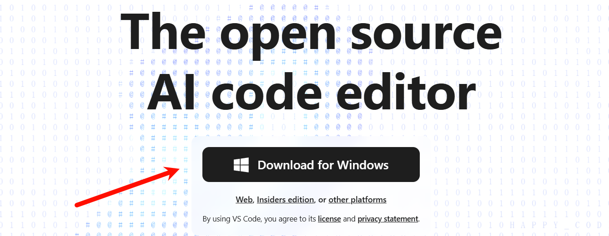
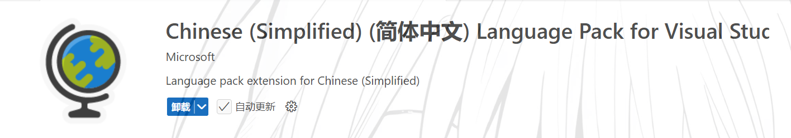
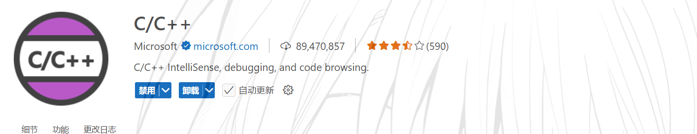
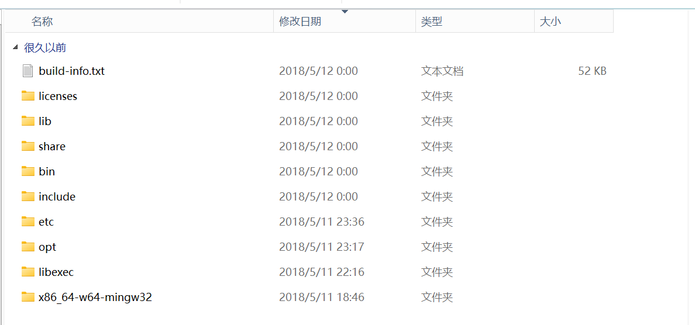
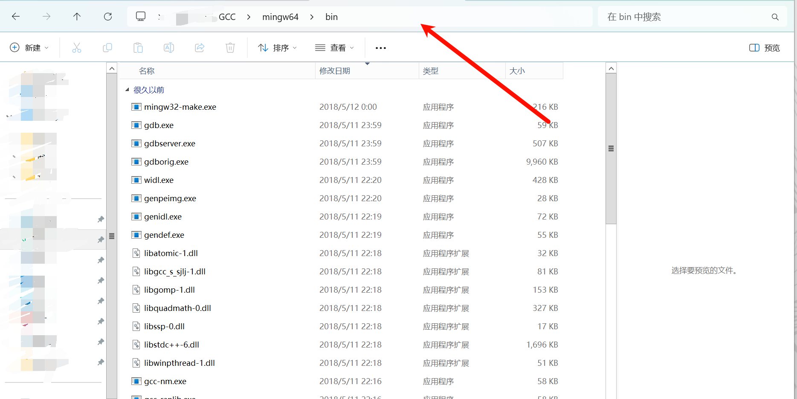
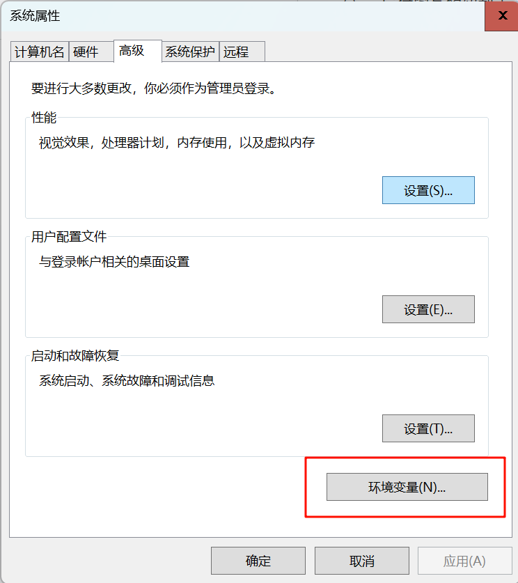
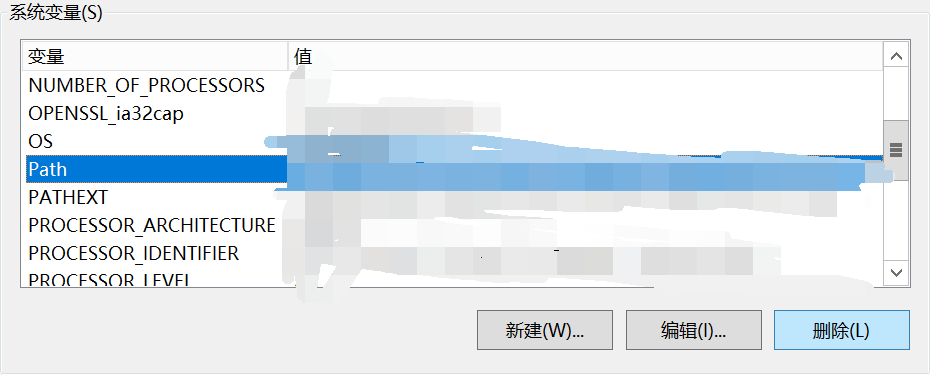
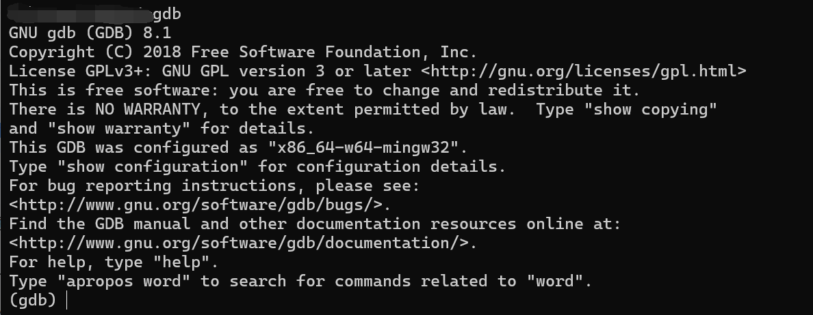
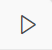
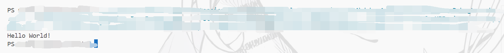

# 如何使用VScode编写C语言

## 前言

对于很多学校来说，C语言常常被作为**第一个**编程语言去学习

但是也不乏有些学校整这些没用的去刁难学生（比如某些专业我个人感觉先学习Python好一些），现在很多老师所谓的学习C语言是为了接触计算机的底层知识，在我这像没说一样。。。

真的要接触底层知识那你在讲课的时候加上底层调用逻辑或者讲一下代码是怎样一步步到可执行文件的过程啊喂🤬(#`O′)

好了言归正传，本文是介绍给各位同学如何去使用插件超级丰富的VScode去编写C语言的，也算是本人写的第一个教程类博客。

---

## 配置VScode

### 下载VScode

VScode其实很多电脑自带的应用商店就会有，这也是个推荐的下载地址，但是一定要认准了是你电脑自带的，不是**你自己下的某60软件管家**


当然也可以从[官网](https://code.visualstudio.com/)下载，直接点击按钮就可以了



下载之后安装，安装的时候没什么太多要注意的，记得把路径改一下改到你喜欢的位置，这个可以不放在C盘

因为我已经安装了，所以具体细节已经变成更新安装的样子了，但是没什么难点，相信大家可以做得到的😎😎

在侧边栏找到这样一个小玩意

对的，然后点进去，搜索几个插件

Chinese：

C/C++：

C/C++我记得会捆绑安装几个其他的包，都安装了之后关闭VScode然后重新打开就好了，这时你的VScode应该是变成了中文

### 配置GCC环境

去官网太慢，我这里有提供一个百度网盘的下载 https://pan.baidu.com/s/1YR2iNwelNtdLeof017yXVg?pwd=ibkk

下载后应该是个压缩包，丢到你喜欢的文件夹下（**<u style="color:#f00808ff">*如果说你的后缀不是.zip，自己去搜怎么开启文件扩展名和隐藏的项目*</u>**）

**<u style="color:#f00808ff">*正式开始之前一定保证VScode，你的代码，以及mingw64不要在任何包含中文的路径下！！！😡😡😡*</u>**

解压，打开后有一个mingw64的文件，双击打开，在里面有这样的目录结构

打开文件夹bin，鼠标在这里点击一下

然后Ctrl+C复制，按Win键（Windows11是可以直接搜索，Windows10要Win+Q开启搜索，win11赢！）

搜索


win10的话应该是不一样的，搜索一下环境变量，高级系统设置等等

在新打开的会话中点击环境变量



再在新会话中找到系统变量的Path

双击，打开之后点击新建，把刚刚复制的东西粘贴进去

然后Win+R运行cmd，输入gdb，会出来这样一些东西



代表你的环境变量配置成功啦！😏（**<u style="color:#f00808ff">*如果说你也不知道环境变量是啥，自己去问AI😒*</u>**）

---

## 编写第一个C语言代码

### 工作区

VScode是有工作区的，在软件左侧栏的图标是这样

点击打开文件夹，这个文件夹选一个你放代码的地方，也是随意

右键新建文件，命名任意，以**.c**或者**.cpp**结尾

编辑文件，输入

```c
#include <stdio.h>
int main(){
    printf("Hello World!\n");
    return 0;
}
```

### 配置文件

好了这就是第一个C语言代码的雏形了，然后再Ctrl+Shift+P，输入tasks——配置默认生成任务->gcc

选择**C/C++:g++.exe 生成活动文件**

编译器的位置一定是刚刚你配置环境变量时粘贴的内容后缀会多一个gcc.exe


他会自动生成一个.vscode/tasks.json文件，在这个文件夹里新建一个launch.json文件

填入，**<u style="color:#f00808ff">*注意我的注释提醒，最后配置好了把注释删掉就行*</u>**

```json
{
 // Use IntelliSense to learn about possible attributes.
 // Hover to view descriptions of existing attributes.
 // For more information, visit: https://go.microsoft.com/fwlink/?linkid=830387
 "version": "0.2.0",
 "configurations": [
 {
 "name": "(gdb) Launch",
 "preLaunchTask":"C/C++: g++.exe 生成活动文件",//调试前执行的任务，就是之前配置的tasks.json中的label字段，复制tasks.json里的内容粘贴过来保证两者一致
 "type": "cppdbg",//配置类型，只能为cppdbg
 "request": "launch",//请求配置类型，可以为launch（启动）或attach（附加）
 "program": "${fileDirname}\\${fileBasenameNoExtension}.exe",//调试程序的路径名称
 "args": [],//调试传递参数
 "stopAtEntry": false,
 "cwd": "${workspaceFolder}",
 "environment": [],
 "externalConsole": false,//true显示外置的控制台窗口，false显示内置终端，推荐false
 "MIMode": "gdb",
 "miDebuggerPath": "C:\\MinGW\\bin\\gdb.exe", // 你的gdb在哪就填哪，刚刚你解压的文件放在哪里了，就从哪里去找，还是在mingw64下的bin，然后找到gdb.exe之后右键复制文件绝对路径
 "setupCommands": [
 {
 "description": "Enable pretty-printing for gdb",
 "text": "-enable-pretty-printing",
 "ignoreFailures": true
 }
 ]
 }
 ]
}
```

### 运行第一个C语言代码

配置好两个json文件之后，点击代码框右上角的

就可以运行了，运行输出Hello World！



至此，本篇保姆级的配置VScode编译C语言教程到此结束，非常适合没有接触过计算机的新大一，或者你身边正好有这样的同学/学弟学妹，觉得本篇还不错的可以把链接分享给他，有什么问题可以去我b站私信（骚扰不回）

谢谢阅读！😘